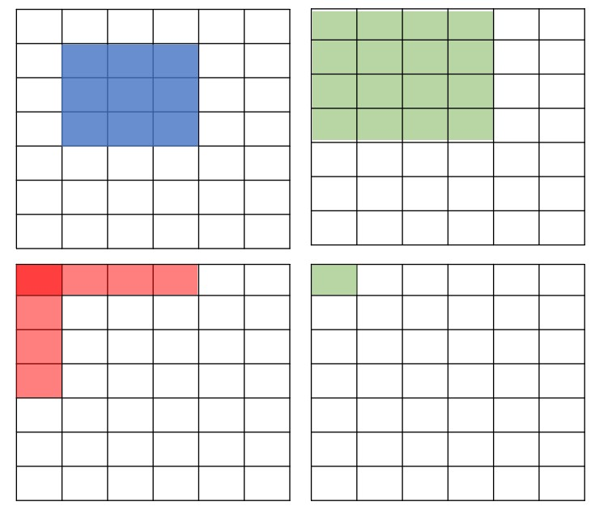

# 문제
링크 : https://www.acmicpc.net/problem/11660
해결여부 : yes

# 코드
```
import sys
input = sys.stdin.readline

n, m = map(int, input().split())
arr = [list(map(int, input().split())) for _ in range(n)]
dp = [[0] * (n+1) for _ in range(n+1)]

dp[1][1] = arr[0][0]
for i in range(1, n+1):
    dp[i][1] = dp[i-1][1] + arr[i-1][0]
    dp[1][i] = dp[1][i-1] + arr[0][i-1]

for i in range(1, n+1):
    for j in range(1, n+1):
        dp[i][j] = dp[i-1][j] + dp[i][j-1] - dp[i-1][j-1] + arr[i-1][j-1]

for _ in range(m):
    y1, x1, y2, x2 = map(int, input().split())
    print(dp[y2][x2] - dp[y1-1][x2] - dp[y2][x1-1] + dp[y1-1][x1-1])
```

# 문제 풀이
2차원 격자 구조에서 직사각형 모양의 공간 내의 모든 숫자의 합을 구한다. 당연히 무식한 방법으로 2중 for문을 돌리면서 구하면 시간초과가 나게 되어 dp를 사용해야 한다.

만약 `[a][b]`부터 `[c][d]` 까지의 누적합을 구하고자 하면 먼저 시작점인 `[0][0]`부터 `[c][d]` 까지의 합을 구한 다음에, 좌측 부분과 상단 부분을 빼 주고, 뺄셈이 두 번 수행된 좌측 상단 부분을 더해주면 될 것이다.

아래 이미지를 보면 이해가 된다.




이 작업을 식으로 표현하면 `dp[y2][x2] - dp[y1-1][x2] - dp[y2][x1-1] + dp[y1-1][x1-1]` 가 된다.

여기서, 주어진 범위가 1이라면 정답이 나오지 않는데 `dp` 배열을 `n+1`만큼 선언해서 1행 1열을 0으로 채워주면 중간에 `- dp[y1-1][x2] - dp[y2][x1-1]` 부분과 `+dp[y1-1][x1-1]` 부분이 0이 될 수 있으므로 점화식 하나만으로 모든 케이스를 커버 가능하다.

# 부족했던 점

# 마무리
